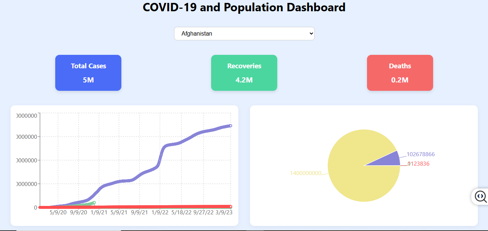

# COVID-19 and Population Dashboard

A responsive React.js dashboard that visualizes COVID-19 statistics (Total Cases, Recoveries, Deaths) using line and pie charts. The app integrates live REST APIs for historical COVID-19 data and global country data.

## 🌐 Live APIs Used
- **COVID-19 Historical Data:** https://disease.sh/v3/covid-19/historical/{country}?lastdays=1500
- **Country List:** https://restcountries.com/v3.1/all

## 🚀 Features
- Country-wise data selection via dropdown
- Total cases, recoveries, and deaths displayed as cards
- Interactive line chart for historical COVID cases
- Pie chart comparing stats to total population
- Responsive and mobile-friendly layout
- Error handling for all API calls

---

## 📦 Installation

```bash
git clone https://github.com/your-username/LeadToRev.git
cd covid19-dashboard-react
npm install
npm start
npm run build
```

---

## 📁 Folder Structure
```
covid19-dashboard-react/
├── src/
│   ├── App.js
│   ├── App.css
│   ├── components/
│   │   ├── CountrySelector.js
│   │   ├── CountrySelector.css
│   │   ├── StatCard.js
│   │   ├── StatCard.css
│   │   ├── LineChartComponent.js
│   │   ├── LineChartComponent.css
│   │   ├── PieChartComponent.js
│   │   ├── PieChartComponent.css
```

---

## 📦 Dependencies
Install these libraries:
```bash
npm install axios recharts
```

## 🧩 Libraries Used
- [React](https://reactjs.org/)
- [Axios](https://github.com/axios/axios) — HTTP client
- [Recharts](https://recharts.org/en-US/) — Chart library for React

## 📸 Dashboard Preview



##🌍 Live Website
-You can explore the fully functional and responsive COVID-19 and Population Dashboard hosted on Netlify:

🔗 https://charming-narwhal-13318c.netlify.app/

✅ What You Can Do on the Live Website:
Select any country from the dropdown to fetch real-time historical COVID-19 data.

View key statistics like total confirmed cases, recoveries, and deaths at a glance.

Analyze trends using the interactive line chart for daily case progression.

Understand proportions with a pie chart comparing COVID stats against the total population.

Enjoy a clean, responsive UI optimized for both desktop and mobile devices.

Experience real-time data fetching and robust error handling for failed API requests.

No installation needed — just open the link and start exploring the data!


---


